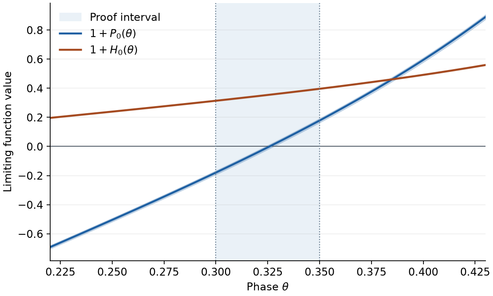

# Self-Avoiding Walk Lab

**Recherche en pause — reprise ouverte : [guide de reprise M5–M14](RESEARCH_HANDOFF.md).**
M13 établit l’unicité conditionnelle dans chaque bande N >= 32. M14 reste
une preuve candidate ; la couverture d’existence de tous les indices est ouverte.


A reproducible research companion on **non-D-finiteness of irreducible
NE-prudent ramps and two-sided weakly prudent bridges**, maintained by
[Njakasoa](https://github.com/Njakasoa).

**Status: internally reviewed research manuscript. Publication priority is
UNRESOLVED. No external peer review or journal/preprint submission is claimed.**

## Result and scope

For the NE-prudent-ramp and hook-ramp series P and H defined by
[Bacher and Beaton (2014)](https://doi.org/10.46298/dmtcs.2445), the manuscript
proves that the irreducible-ramp generating function

```text
J(t) = (P(t) - H(t)) / (1 + P(t))
```

is not D-finite. The proposed contribution is the infinite noncancellation
argument: a uniform Gamma-product limit and exact integral-sign certificates
produce infinitely many genuine poles of J accumulating at sqrt(2)-1.
The published kernel formulas and meromorphic continuation are cited inputs.

The new, separately reviewed W proof establishes non-D-finiteness of the
two-sided weakly prudent bridge series W=I/(1-I), with I=4J-2D_I-t.
It constructs infinitely many zeros of 1-I where I is holomorphic and equals
1; these are genuine W poles. A new phase interval [4/5,9/10], the directed
ramp limit D_I->1, and exact limiting-sign certificates supply the argument.
This conclusion is not inferred from J alone.

The 11-page manuscript below still covers J. The W extension is a separate
proof dossier. Neither result gives an exact square-lattice connective
constant or a new record bound. Internal review does not settle priority.

- [Manuscript PDF — 11 pages](publication/main.pdf)
- [LaTeX source](publication/main.tex) and [reproduction guide](publication/VALIDATION.md)
- [Contribution review](publication/CONTRIBUTION_REVIEW.md) and [priority audit](publication/PRIORITY_AUDIT.md)
- [M3 acceptance](M3_ACCEPTANCE.md), [M4 acceptance](M4_ACCEPTANCE.md), and [independent manuscript review](results/m4-astra-review.md)
- [W proof](proofs/W_NON_DFINITE.md), [W acceptance and evidence](W_ACCEPTANCE.md), and [independent W review](results/w-final-review.md)
- [Combined external-review reading guide](publication/REVIEW_J_W.md)
- [Next research steps](RESEARCH_ROADMAP.md)



The plot illustrates the limiting functions. The proof uses exact interval
enclosures and the separately reviewed uniform-convergence argument.

## Reproduce

Use Python 3.12 from the repository root:

```sh
python3 -m venv .venv
.venv/bin/python -m pip install -r publication/requirements-lock.txt
.venv/bin/python scripts/check_public_snapshot.py
.venv/bin/python -m pytest -q
.venv/bin/python publication/reproduce.py
.venv/bin/python publication/reproduce_w.py
```

The focused publication command checks the frozen source manifest, replays
two independent symbolic implementations and the exact limiting-integral
certificate, verifies five finite pole brackets and geometric coefficients
through length 12, then regenerates the figure. It needs no account or API key.
Python -O is rejected because it would disable checker assertions.

The earlier J/W publication suite passed **54 tests**; the M13 checkpoint passed **62 tests**. A second isolated
copy reproduced the publication calculations and byte-identical figures;
source tampering and disabled assertions were rejected. The analytical
infinite-pole proof remains a mathematical argument, not a proof-assistant
formalization. The programs alone do not prove its convergence theorem.

The W command verifies the retained scientific source hashes, recomputes the
exact quotient/recurrence checks and the full limiting-sign certificate, and
compares both payloads with the recorded results. It needs neither the private
Git history nor third-party PDFs. The 34 finite numerical cases, including
failed endpoint signs at N=8,16, remain exploratory evidence; they do not
certify finite poles or an effective first index.

For a local PDF build, install Tectonic as documented in
[TOOLCHAIN.json](publication/TOOLCHAIN.json), then run:

```sh
.venv/bin/python publication/reproduce.py --pdf --tectonic /path/to/tectonic
```

## Public snapshot and provenance

This public repository starts from a curated snapshot. The original lab's
private Git history, operational settings, session notes and third-party
paper copies are excluded. `SOURCE_MANIFEST.json` records the exported file
hashes and the original source revision. Historical experiment receipts are
retained unchanged: their source commit IDs and machine paths describe the
original lab and are not resolvable Git history in this public snapshot.

Use `publication/reproduce.py` for the portable M4 reproduction gate and
`publication/reproduce_w.py` for the W arithmetic replay.
Older historical receipt checkers that call `git show` require the original
history and, in some cases, separately downloaded source papers. New local
experiments can freeze their own source commits and create fresh receipts.
The generated `publication/VALIDATION.json` is intentionally excluded from
the public snapshot manifest because each replay replaces it.

## License and citation

Project code: [MIT](LICENSE). Manuscript/figure rights and third-party scope:
[RIGHTS.md](publication/RIGHTS.md). Citation metadata: [CITATION.cff](CITATION.cff).
No DOI, arXiv identifier or external reviewer endorsement is invented.
